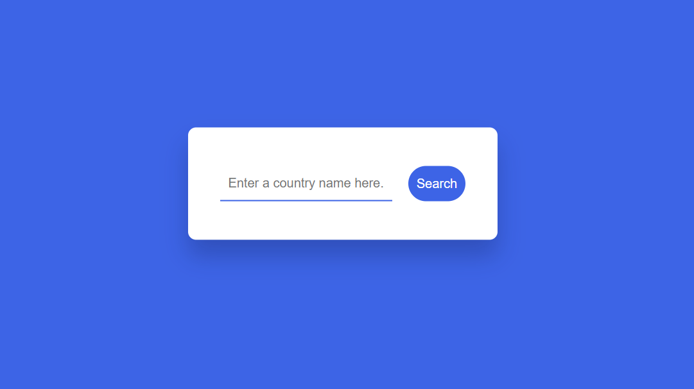
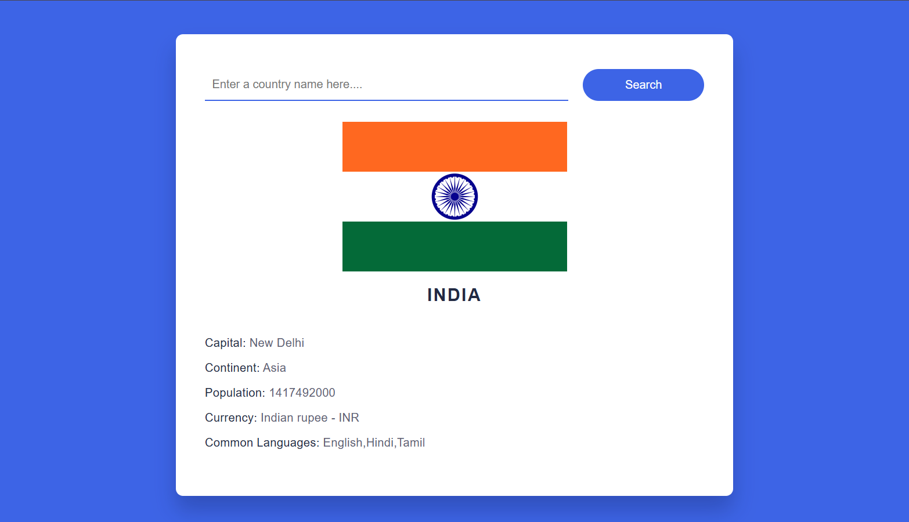

# 🌍 Country Guide App

A simple and interactive web application that lets users get information about any country such as its capital, population, currency, time zones, and flag using a country search feature.

This app is built with HTML, CSS, and JavaScript, and uses a public API to fetch real-time country data.

## 🚀 Features

- 🔍 Search for a country by name

- 📌 Displays country details including:

   - Capital city

   - Population

   - Region

   - Time zones

   - Currency and symbol

   - National flag

- ⏱️ Real-time data fetch using REST API

- 🖼️ Clean and responsive user interface

## 🛠️ Technologies Used

- HTML for webpage structure

- CSS for styling and layout

- JavaScript for logic and API calls

- REST Countries API for fetching country information

## 🧠 How It Works

- User enters a country name in the search box

- App sends a request to the API

- API returns country information

- App displays the data dynamically on the page

## 📸 Demo Screenshots 

### 🔹 Home Screen

### 🔹 Search Result

## 🧪 How to Use It Locally

1. Clone the repository

   git clone https://github.com/SravaniMuduru/Countryguide-app.git

2. Open the project folder

   cd Countryguide-app

3. Run it in your browser

   Just open index.html in any web browser.

## 📌 Live Preview

- You can host it easily using GitHub Pages:

- Go to Settings → Pages

- Set Source to main branch and / (root)

- Save — your app will be live at https://SravaniMuduru.github.io/Countryguide-app/

## 💡 Future Enhancements

- Add autocomplete suggestions while typing

- Support mobile-first responsive UI

- Add dark mode toggle

- Add loading indicators and error handling enhancements
